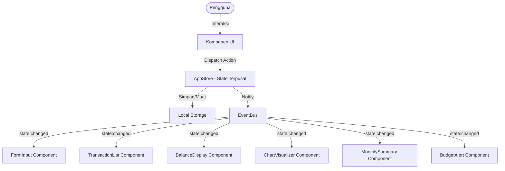
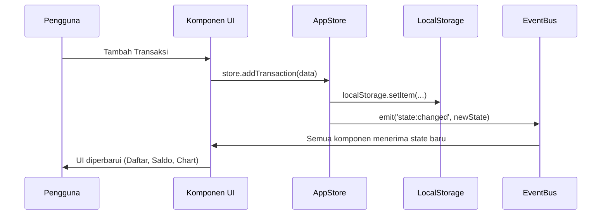

# Dokumen Desain: Expense & Budget Visualizer

## Ikhtisar

Expense & Budget Visualizer adalah aplikasi web mobile-friendly yang dibangun menggunakan HTML, CSS, dan Vanilla JavaScript murni tanpa framework. Aplikasi ini memungkinkan pengguna mencatat pengeluaran harian, memantau total saldo, memvisualisasikan distribusi pengeluaran per kategori melalui pie chart interaktif (Chart.js), serta mengelola anggaran dengan fitur peringatan batas pengeluaran.

Seluruh data disimpan secara lokal di browser menggunakan Local Storage API sehingga tidak memerlukan server backend. Aplikasi dapat dijalankan langsung dari file `index.html` menggunakan protokol `file://`.

### Tujuan Desain

- **Kesederhanaan**: Satu file HTML, satu file CSS, satu file JavaScript — mudah dipelihara.
- **Reaktivitas**: Setiap perubahan data langsung memperbarui semua komponen UI yang relevan.
- **Ketahanan**: Penanganan error yang baik untuk kasus Local Storage tidak tersedia atau data rusak.
- **Performa**: Semua interaksi merespons dalam < 200ms; pemuatan halaman < 3 detik.

---

## Arsitektur

Aplikasi menggunakan pola **Observer/Event-Driven** dengan **State Store terpusat**. Pola ini dipilih karena:

1. Memungkinkan sinkronisasi otomatis antar komponen (misalnya, menambah transaksi langsung memperbarui Saldo, Chart, dan Daftar sekaligus).
2. Cocok untuk Vanilla JS tanpa framework — tidak perlu library tambahan.
3. Memisahkan logika bisnis (Store) dari logika tampilan (komponen UI).



### Alur Data



### Struktur File

```
project-root/
├── index.html          ← Entry point utama
├── css/
│   └── style.css       ← Satu file CSS (termasuk dark/light mode)
└── js/
    └── app.js          ← Satu file JavaScript (semua logika)
```

---

## Komponen dan Antarmuka

Seluruh kode JavaScript berada dalam satu file `app.js` yang diorganisir menggunakan **IIFE (Immediately Invoked Function Expression)** dan **Module Pattern** untuk menghindari polusi namespace global.

### 1. AppStore (State Management)

Bertanggung jawab atas seluruh state aplikasi dan persistensi ke Local Storage.

```
AppStore {
  // State
  state: AppState

  // Metode Publik
  getState(): AppState
  addTransaction(item: TransactionInput): Result<Transaction, ValidationError>
  deleteTransaction(id: string): Result<void, StorageError>
  addCategory(name: string): Result<Category, ValidationError>
  setBudgetLimit(amount: number): Result<void, ValidationError>
  setSortOrder(order: SortOrder): void
  setTheme(theme: Theme): void
  loadFromStorage(): void
}
```

### 2. EventBus

Mekanisme publish-subscribe sederhana untuk komunikasi antar komponen.

```
EventBus {
  subscribe(event: string, callback: Function): void
  unsubscribe(event: string, callback: Function): void
  emit(event: string, data: any): void
}
```

**Event yang didefinisikan:**
- `state:changed` — dipancarkan setiap kali AppStore memperbarui state
- `error:storage` — dipancarkan ketika operasi Local Storage gagal

### 3. FormInput Component

Mengelola form input transaksi baru.

```
FormInput {
  render(): void
  validate(data: TransactionInput): ValidationResult
  handleSubmit(event: Event): void
  reset(): void
  preventNonNumeric(event: KeyboardEvent): void
}
```

### 4. TransactionList Component

Menampilkan daftar transaksi dengan fitur hapus dan pengurutan.

```
TransactionList {
  render(transactions: Transaction[]): void
  handleDelete(id: string): void
  handleSortChange(order: SortOrder): void
  getSortedTransactions(transactions: Transaction[], order: SortOrder): Transaction[]
  formatCurrency(amount: number): string
}
```

### 5. BalanceDisplay Component

Menampilkan total saldo dan indikator peringatan batas pengeluaran.

```
BalanceDisplay {
  render(total: number, budgetLimit: number): void
  formatCurrency(amount: number): string
  checkBudgetWarning(total: number, limit: number): boolean
}
```

### 6. ChartVisualizer Component

Merender pie chart menggunakan Chart.js.

```
ChartVisualizer {
  chartInstance: Chart | null
  render(transactions: Transaction[]): void
  buildChartData(transactions: Transaction[]): ChartData
  destroy(): void
  showPlaceholder(): void
}
```

### 7. MonthlySummary Component

Menampilkan ringkasan pengeluaran per bulan.

```
MonthlySummary {
  render(transactions: Transaction[]): void
  groupByMonth(transactions: Transaction[]): MonthGroup[]
  handleMonthSelect(monthKey: string): void
  formatMonthLabel(monthKey: string): string
}
```

### 8. CategoryManager Component

Mengelola kategori bawaan dan kategori kustom.

```
CategoryManager {
  DEFAULT_CATEGORIES: string[]  // ['Makanan', 'Transportasi', 'Hiburan']
  MAX_CUSTOM_CATEGORIES: number // 20
  render(categories: Category[]): void
  handleAddCategory(name: string): void
  populateDropdown(categories: Category[]): void
}
```

### 9. ThemeManager

Mengelola dark/light mode.

```
ThemeManager {
  applyTheme(theme: Theme): void
  toggleTheme(): void
  loadThemeFromStorage(): void
}
```

### 10. StorageService

Abstraksi atas Local Storage API dengan penanganan error.

```
StorageService {
  KEYS: StorageKeys
  save(key: string, data: any): Result<void, StorageError>
  load(key: string): Result<any, StorageError>
  remove(key: string): Result<void, StorageError>
  isAvailable(): boolean
}
```

---

## Model Data

### Transaction

```typescript
interface Transaction {
  id: string;           // UUID v4 yang di-generate saat pembuatan
  itemName: string;     // Nama item, maks. 100 karakter
  amount: number;       // Jumlah pengeluaran, > 0, maks. 999_999_999.99
  category: string;     // Nama kategori
  timestamp: string;    // ISO 8601 (contoh: "2024-01-15T10:30:00.000+07:00")
}
```

### Category

```typescript
interface Category {
  name: string;         // Nama kategori, maks. 50 karakter
  isDefault: boolean;   // true untuk Makanan, Transportasi, Hiburan
}
```

### AppState

```typescript
interface AppState {
  transactions: Transaction[];
  categories: Category[];
  budgetLimit: number;        // 0 berarti tidak ada batas
  sortOrder: SortOrder;       // 'default' | 'amount_asc' | 'amount_desc' | 'category_az'
  theme: Theme;               // 'light' | 'dark'
}
```

### SortOrder

```typescript
type SortOrder = 'default' | 'amount_asc' | 'amount_desc' | 'category_az';
```

### Theme

```typescript
type Theme = 'light' | 'dark';
```

### StorageKeys

```typescript
const STORAGE_KEYS = {
  TRANSACTIONS: 'ebv_transactions',
  CATEGORIES:   'ebv_categories',
  BUDGET_LIMIT: 'ebv_budget_limit',
  THEME:        'ebv_theme',
} as const;
```

### ValidationResult

```typescript
interface ValidationResult {
  isValid: boolean;
  errors: { field: string; message: string }[];
}
```

### ChartData (untuk Chart.js)

```typescript
interface ChartData {
  labels: string[];       // Nama kategori
  datasets: [{
    data: number[];       // Total pengeluaran per kategori
    backgroundColor: string[];  // Warna per segmen
  }]
}
```

### MonthGroup

```typescript
interface MonthGroup {
  monthKey: string;       // Format: "YYYY-MM" (contoh: "2024-01")
  label: string;          // Format: "Januari 2024"
  total: number;          // Total pengeluaran bulan tersebut
  transactions: Transaction[];
}
```

---

## Properti Kebenaran (Correctness Properties)

*Properti adalah karakteristik atau perilaku yang harus berlaku di seluruh eksekusi sistem yang valid — pada dasarnya, pernyataan formal tentang apa yang seharusnya dilakukan sistem. Properti berfungsi sebagai jembatan antara spesifikasi yang dapat dibaca manusia dan jaminan kebenaran yang dapat diverifikasi secara otomatis.*

### Properti 1: Penambahan transaksi valid memperbesar daftar tepat satu

*Untuk setiap* daftar transaksi yang ada dan data transaksi valid (nama item non-kosong dan non-whitespace, jumlah > 0 dan ≤ 999.999.999,99, kategori terdaftar), menambahkan transaksi tersebut harus menghasilkan panjang daftar bertambah tepat satu dan transaksi baru dapat ditemukan dalam daftar.

**Memvalidasi: Requirements 1.4, 2.1**

---

### Properti 2: Input tidak valid selalu ditolak dengan pesan error per field

*Untuk setiap* kombinasi input form yang mengandung setidaknya satu field tidak valid (nama item kosong/whitespace, jumlah ≤ 0, jumlah > 999.999.999,99, atau kategori tidak dipilih), fungsi validasi harus mengembalikan `isValid = false` dan `errors` yang menyebutkan nama field yang bermasalah.

**Memvalidasi: Requirements 1.2, 1.3, 1.7**

---

### Properti 3: Penghapusan transaksi mengurangi daftar tepat satu

*Untuk setiap* daftar transaksi yang berisi minimal satu transaksi, menghapus transaksi dengan ID yang valid harus menghasilkan panjang daftar berkurang tepat satu dan transaksi tersebut tidak lagi dapat ditemukan dalam daftar berdasarkan ID-nya.

**Memvalidasi: Requirements 2.3**

---

### Properti 4: Saldo total selalu sama dengan jumlah semua amount dan tidak pernah negatif

*Untuk setiap* kumpulan transaksi (termasuk kumpulan kosong), nilai total yang dihitung harus sama persis dengan penjumlahan seluruh field `amount` dari semua transaksi, dan hasilnya tidak pernah bernilai negatif.

**Memvalidasi: Requirements 3.1, 3.2, 3.3, 3.6**

---

### Properti 5: Format mata uang Rupiah selalu menghasilkan string yang valid

*Untuk setiap* nilai numerik non-negatif, fungsi `formatCurrency` harus menghasilkan string yang: (a) diawali dengan "Rp", (b) menggunakan titik sebagai pemisah ribuan, dan (c) menggunakan koma sebagai pemisah desimal dengan tepat dua angka di belakang koma.

**Memvalidasi: Requirements 3.4**

---

### Properti 6: Round-trip persistensi transaksi ke Local Storage

*Untuk setiap* transaksi valid yang disimpan ke Local Storage, memuat kembali data dari Local Storage harus menghasilkan objek transaksi yang ekuivalen — semua field (id, itemName, amount, category, timestamp) bernilai sama dengan data yang disimpan.

**Memvalidasi: Requirements 5.1, 5.2, 5.3**

---

### Properti 7: Kategori kustom tidak boleh duplikat (case-insensitive)

*Untuk setiap* daftar kategori yang ada, mencoba menambahkan kategori dengan nama yang sudah ada — termasuk variasi huruf besar/kecil dan whitespace di awal/akhir — harus ditolak dan daftar kategori tidak boleh berubah.

**Memvalidasi: Requirements 6.5**

---

### Properti 8: Round-trip persistensi kategori kustom ke Local Storage

*Untuk setiap* nama kategori kustom valid (non-kosong, non-whitespace, panjang ≤ 50 karakter, belum ada dalam daftar), menyimpannya ke Local Storage lalu memuat kembali harus menghasilkan kategori tersebut tersedia dalam daftar kategori dan dapat dipilih di dropdown Form_Input.

**Memvalidasi: Requirements 5.4, 5.5, 6.3, 6.4**

---

### Properti 9: Pengurutan transaksi bersifat idempoten

*Untuk setiap* daftar transaksi dan opsi pengurutan yang valid (`amount_asc`, `amount_desc`, `category_az`), menerapkan fungsi pengurutan dua kali berturut-turut harus menghasilkan urutan yang identik dengan menerapkannya satu kali.

**Memvalidasi: Requirements 8.1, 8.2, 8.3**

---

### Properti 10: Indikator peringatan konsisten dengan perbandingan total dan batas

*Untuk setiap* nilai total pengeluaran dan nilai batas pengeluaran yang valid (> 0), fungsi `checkBudgetWarning` harus mengembalikan `true` jika dan hanya jika total ≥ batas, dan mengembalikan `false` untuk semua kondisi lainnya (termasuk batas = 0).

**Memvalidasi: Requirements 9.3, 9.5, 9.6**

---

### Properti 11: Pengelompokan bulanan menghasilkan total yang akurat per grup

*Untuk setiap* kumpulan transaksi dengan timestamp yang bervariasi, fungsi `groupByMonth` harus menghasilkan grup-grup di mana: (a) setiap transaksi masuk ke tepat satu grup, (b) total per grup sama dengan penjumlahan amount semua transaksi dalam grup tersebut, dan (c) grup diurutkan dari bulan terbaru ke terlama.

**Memvalidasi: Requirements 7.1, 7.2, 7.5**

---

## Penanganan Error

### Strategi Umum

Semua operasi yang dapat gagal menggunakan pola `Result<T, E>` sederhana:

```javascript
// Implementasi Result pattern di Vanilla JS
function ok(value) { return { success: true, value }; }
function err(error) { return { success: false, error }; }
```

### Skenario Error dan Penanganannya

| Skenario | Komponen | Penanganan |
|---|---|---|
| Local Storage tidak tersedia | StorageService | Mulai dengan state kosong, tampilkan banner peringatan |
| Data JSON rusak di Local Storage | StorageService | Reset ke state kosong, tampilkan pesan peringatan |
| Penghapusan dari Local Storage gagal | TransactionList | Batalkan penghapusan dari UI, tampilkan pesan error |
| Field form kosong/tidak valid saat submit | FormInput | Tampilkan pesan error per field, jangan proses transaksi |
| Jumlah melebihi 999.999.999,99 | FormInput | Tampilkan pesan error, tolak input |
| Kategori duplikat | CategoryManager | Tampilkan "Kategori sudah ada.", tolak penambahan |
| Kategori kosong/whitespace | CategoryManager | Tampilkan "Nama kategori tidak boleh kosong.", tolak |
| Batas 20 kategori kustom tercapai | CategoryManager | Tampilkan pesan batas tercapai, tolak penambahan |
| Nilai batas pengeluaran tidak valid | BudgetAlert | Tampilkan pesan error, jangan simpan nilai |
| Chart.js gagal dimuat dari CDN | ChartVisualizer | Tampilkan pesan fallback, log error ke console |

### Penanganan Local Storage Rusak

```javascript
// Pseudocode di StorageService.load()
function load(key) {
  try {
    const raw = localStorage.getItem(key);
    if (raw === null) return ok(null);
    return ok(JSON.parse(raw));
  } catch (e) {
    // JSON.parse gagal — data rusak
    return err({ type: 'PARSE_ERROR', key, originalError: e });
  }
}
```

Ketika `loadFromStorage()` di AppStore menerima error, aplikasi:
1. Menggunakan state default (transaksi kosong, kategori bawaan saja)
2. Menampilkan banner peringatan: *"Data sebelumnya tidak dapat dimuat. Memulai dengan data baru."*
3. Tidak menghapus data yang rusak secara otomatis (pengguna yang memutuskan)

---

## Strategi Pengujian

### Pendekatan Pengujian Ganda

Aplikasi ini menggunakan dua lapisan pengujian yang saling melengkapi:

1. **Unit Test (Contoh-Berbasis)**: Memverifikasi perilaku spesifik dengan contoh konkret — kasus tepi, kondisi error, dan integrasi antar komponen.
2. **Property-Based Test (PBT)**: Memverifikasi properti universal yang harus berlaku untuk semua input valid — menggunakan library [fast-check](https://fast-check.dev/) untuk JavaScript.

### Library yang Digunakan

- **Test Runner**: [Vitest](https://vitest.dev/) — kompatibel dengan Vanilla JS, cepat, dan mendukung ESM.
- **PBT Library**: [fast-check](https://fast-check.dev/) — library PBT terkemuka untuk JavaScript/TypeScript.
- **Minimum iterasi per property test**: 100 iterasi.

### Konfigurasi Property Test

Setiap property test harus diberi tag komentar yang mereferensikan properti desain:

```javascript
// Feature: expense-budget-visualizer, Property 1: Penambahan transaksi valid memperbesar daftar tepat satu
test.prop([
  fc.array(validTransactionArb),
  validTransactionArb
])('menambah transaksi valid selalu memperbesar daftar sebesar 1', (existingList, newTx) => {
  const store = createStore(existingList);
  store.addTransaction(newTx);
  expect(store.getState().transactions).toHaveLength(existingList.length + 1);
  expect(store.getState().transactions.find(t => t.id === newTx.id)).toBeDefined();
});
```

### Cakupan Unit Test

| Komponen | Fokus Pengujian |
|---|---|
| `StorageService` | Muat data valid, data rusak, Local Storage tidak tersedia |
| `FormInput.validate()` | Field kosong, jumlah negatif, jumlah melebihi batas, karakter non-numerik |
| `TransactionList.getSortedTransactions()` | Semua opsi pengurutan, daftar kosong, daftar satu item |
| `BalanceDisplay.formatCurrency()` | Nol, nilai besar, nilai dengan desimal |
| `CategoryManager` | Duplikat, nama kosong, batas 20 kategori |
| `MonthlySummary.groupByMonth()` | Transaksi lintas bulan, bulan yang sama, daftar kosong |
| `ChartVisualizer.buildChartData()` | Satu kategori, banyak kategori, transaksi kosong |
| `ThemeManager` | Toggle tema, muat dari storage, default tanpa storage |

### Cakupan Property Test

Setiap properti kebenaran di atas diimplementasikan sebagai satu property-based test:

| Properti | Arbitrari yang Digunakan |
|---|---|
| P1: Penambahan memperbesar daftar | `fc.array(validTransactionArb)`, `validTransactionArb` |
| P2: Input tidak valid ditolak | `fc.record` dengan field tidak valid yang di-generate |
| P3: Penghapusan mengurangi daftar | `fc.array(validTransactionArb, { minLength: 1 })`, `fc.nat()` (index) |
| P4: Saldo = sum(amounts), tidak negatif | `fc.array(fc.float({ min: 0.01, max: 999999999.99 }))` |
| P5: Format mata uang valid | `fc.float({ min: 0, max: 999999999.99 })` |
| P6: Round-trip persistensi transaksi | `validTransactionArb` |
| P7: Kategori tidak duplikat | `fc.array(fc.string())`, `fc.string()` dengan variasi case |
| P8: Round-trip persistensi kategori | `fc.string({ minLength: 1, maxLength: 50 })` |
| P9: Pengurutan idempoten | `fc.array(validTransactionArb)`, `fc.constantFrom(...sortOrders)` |
| P10: Peringatan konsisten dengan total | `fc.float({ min: 0.01 })` (limit), `fc.float({ min: 0 })` (total) |
| P11: Pengelompokan bulanan akurat | `fc.array(validTransactionArb)` dengan timestamp bervariasi |

### Smoke Test

- Verifikasi file `index.html`, `css/style.css`, dan `js/app.js` ada di lokasi yang benar
- Verifikasi halaman dapat dibuka dari protokol `file://` tanpa error JavaScript
- Verifikasi Chart.js berhasil dimuat dari CDN
